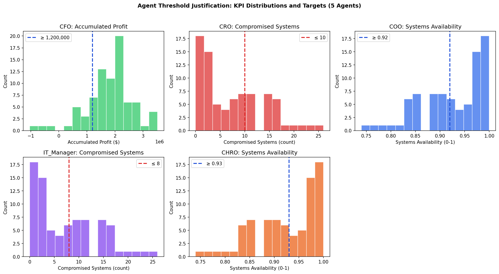
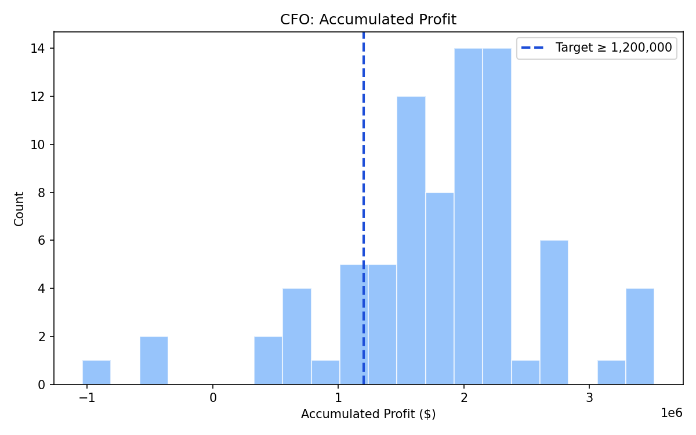
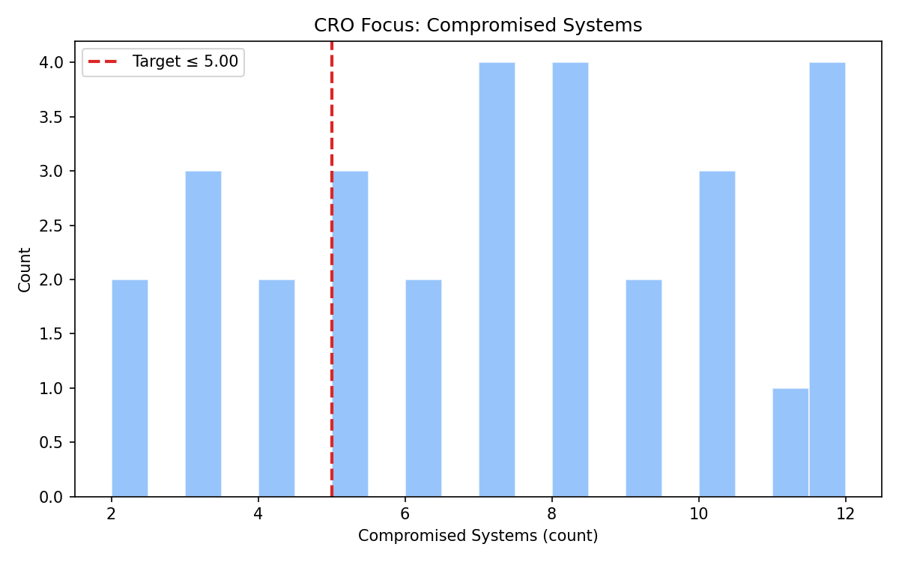
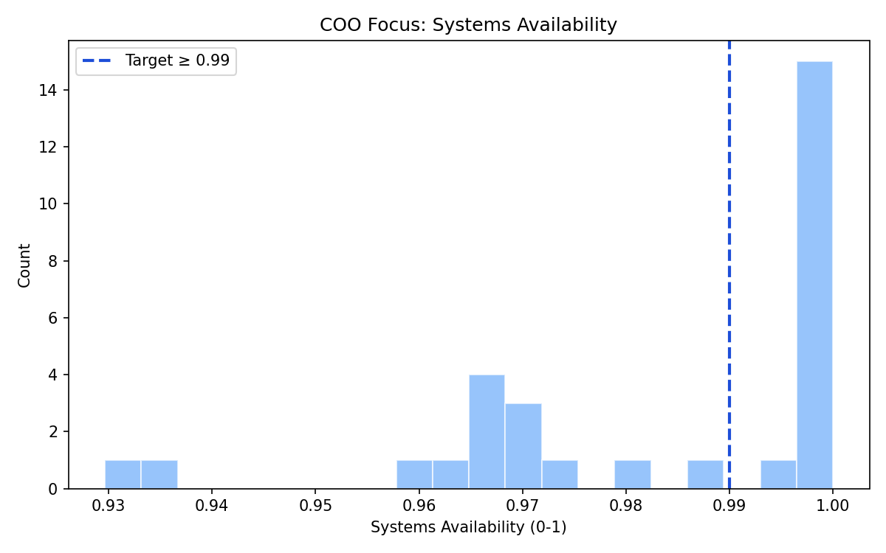
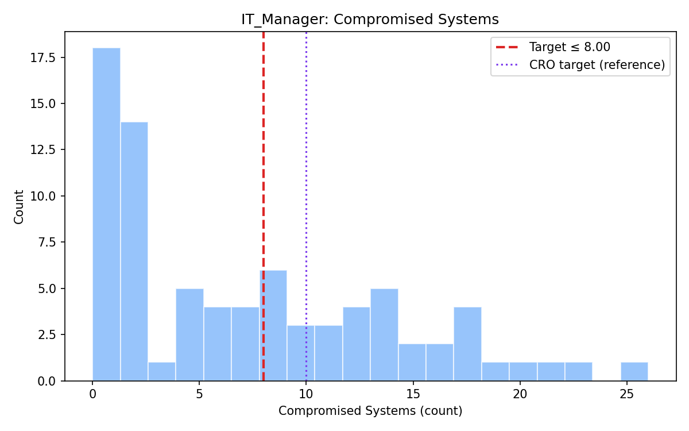
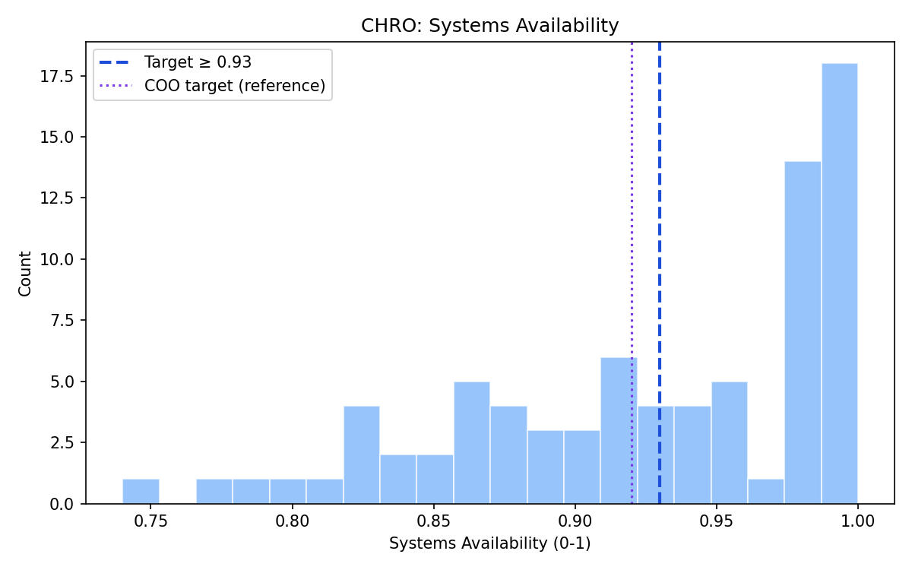

# Agent Settings Justification

This report explains and visualizes why the **five agent** settings (CFO, CRO, COO, IT_Manager, CHRO) are appropriate based on the distribution of results in the simulation dataset.

**Data source**: Distributions are computed from simulation runs (e.g. `optimization_results.json`, `sim_data.csv`, or `simulation_data.json`). Agent targets and personalities are from `config/agent_config.json`.

ach agent has a dedicated distribution plot (histogram + target line) justifying its threshold.

## Summary: All Agents

The figure below shows each agent's KPI distribution and target threshold in one view.

---

## CFO

- **KPI Focus**: `accumulated_profit`
- **Target**: `min = 1,200,000.00`
- **Personality**:
  - risk_tolerance: `0.3`
  - friendliness: `0.6`
  - ambition: `0.8`

- **Data distribution**:
  - count: `80`
  - min→max: `-1,038,000.00` → `3,517,160.77`
  - mean / median: `1,806,128.83` / `1,912,116.17`
  - stdev: `823,206.51`
  - p30 / p50 / p70: `1,538,800.00` / `1,912,116.17` / `2,166,494.74`
- **Share meeting target**: `81.2%`

- **Rationale**: The target is set near the upper distribution (≈p70) to be achievable yet challenging, given mean `1,806,128.83` and stdev `823,206.51`.

## CRO

- **KPI Focus**: `compromised_systems`
- **Target**: `max = 10.00`
- **Personality**:
  - risk_tolerance: `0.2`
  - friendliness: `0.5`
  - ambition: `0.6`

- **Data distribution**:
  - count: `80`
  - min→max: `0.00` → `26.00`
  - mean / median: `7.25` / `6.00`
  - stdev: `6.69`
  - p30 / p50 / p70: `2.00` / `6.00` / `11.00`
- **Share meeting target**: `68.8%`

- **Rationale**: The cap is set near the lower distribution (≈p30) to reflect risk limits, given mean `7.25` and stdev `6.69`.

## COO

- **KPI Focus**: `systems_availability`
- **Target**: `min = 0.92`
- **Personality**:
  - risk_tolerance: `0.5`
  - friendliness: `0.7`
  - ambition: `0.7`

- **Data distribution**:
  - count: `80`
  - min→max: `0.74` → `1.00`
  - mean / median: `0.93` / `0.94`
  - stdev: `0.07`
  - p30 / p50 / p70: `0.89` / `0.94` / `0.98`
- **Share meeting target**: `60.0%`

- **Rationale**: The target is set near the upper distribution (≈p70) to be achievable yet challenging, given mean `0.93` and stdev `0.07`.

## IT_Manager

- **KPI Focus**: `compromised_systems`
- **Target**: `max = 8.00`
- **Personality**:
  - risk_tolerance: `0.25`
  - friendliness: `0.6`
  - ambition: `0.7`

- **Data distribution**:
  - count: `80`
  - min→max: `0.00` → `26.00`
  - mean / median: `7.25` / `6.00`
  - stdev: `6.69`
  - p30 / p50 / p70: `2.00` / `6.00` / `11.00`
- **Share meeting target**: `60.0%`

- **Rationale**: The cap is set near the lower distribution (≈p30) to reflect risk limits, given mean `7.25` and stdev `6.69`.

## CHRO

- **KPI Focus**: `systems_availability`
- **Target**: `min = 0.93`
- **Personality**:
  - risk_tolerance: `0.4`
  - friendliness: `0.75`
  - ambition: `0.65`

- **Data distribution**:
  - count: `80`
  - min→max: `0.74` → `1.00`
  - mean / median: `0.93` / `0.94`
  - stdev: `0.07`
  - p30 / p50 / p70: `0.89` / `0.94` / `0.98`
- **Share meeting target**: `52.5%`

- **Rationale**: The target is set near the upper distribution (≈p70) to be achievable yet challenging, given mean `0.93` and stdev `0.07`.
